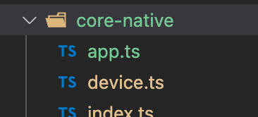

# TEST DE COMPONENTS NATIUS

Cada vegada que angular, ionic o capacitor puja de versions utilitzarem aquest projecte per provar i arreglar tots els compoments.

## Pasos a seguir.

1. Actualitzem el client de `ionic`. https://ionicframework.com/docs/intro/cli#start-an-app

    ```properties
    npm uninstall -g ionic
    npm install -g @ionic/cli
    ```

1. Crearem un nou projecte de ionic

    ```properties
    ionic start test-natice sidemenu
    ```

1. Copiarem tal cual la carpeta `app` al nou projecte.

1. En aquesta carpeta tenim `src/app/app-routing.module.ts`. On tindrem que anar descomentant els component que volguem provar.

    ```ts
      // {
      //   path: 'app',
      //   loadChildren: () => import('./app/app.module').then( m => m.AppPageModule)
      // }
    ```

1. Aquest components els tenim en el projecte a la carpeta `src/core-native`

      ]

1. I descomentant del l'arxiu `src/core-native/index.ts`, pq els puguis indexar.

1. En cata component tens la manera de instalarlo, per exemple: `app.ts`

    ```ts
      * **Capacitor**
      *
      * - Api: {@link https://capacitorjs.com/docs/apis/app}
      * - Examples : {@link https://medium.com/javascript-in-plain-english/opening-another-app-from-your-ionic-5-app-becf8c098d0e}
      */
    ```