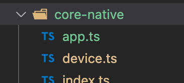
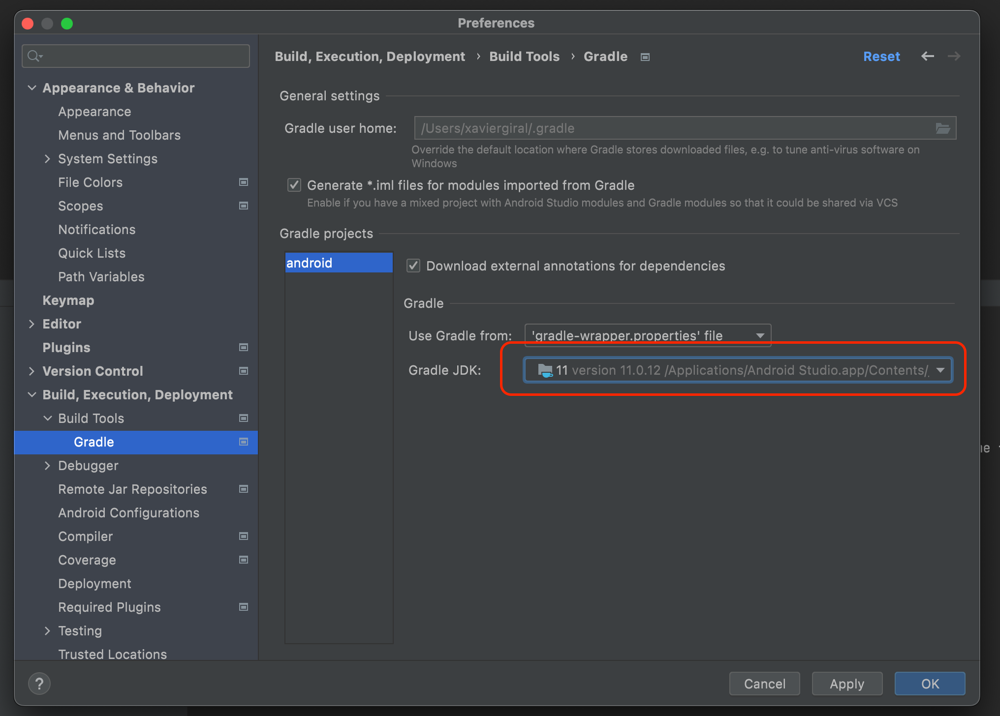

# TEST DE COMPONENTS NATIUS

Cada vegada que angular, ionic o capacitor puja de versions utilitzarem aquest projecte per provar i arreglar tots els compoments.

## Pasos a seguir.

1. Actualitzem el client de `ionic`. https://ionicframework.com/docs/intro/cli#start-an-app

    ```properties
    npm uninstall -g ionic
    npm install -g @ionic/cli
    ```

1. Crearem un nou projecte de ionic

    ```properties
    ionic start test-natice sidemenu
    ```

1. Copiarem tal cual la carpeta `app` al nou projecte.


1. Tenim q compilar el nou projecte.

    ```properties
    ionic serve
    ```

1. Instalem ios i androdid, https://capacitorjs.com/docs/getting-started 

    ```properties
    npm i @capacitor/android @capacitor/ios
    npx cap add android
    npx cap add ios
    ```

1. Instalem electron https://capacitor-community.github.io/electron/docs/gettingstarted
    ```properties
    npm i @capacitor-community/electron
    ```

1. En aquesta carpeta tenim `src/app/app-routing.module.ts`. On tindrem que anar descomentant els component que volguem provar.

    ```ts
      // {
      //   path: 'app',
      //   loadChildren: () => import('./app/app.module').then( m => m.AppPageModule)
      // }
    ```

1. Aquest components els tenim en el projecte a la carpeta `src/core-native`

      []

1. I descomentant del l'arxiu `src/core-native/index.ts`, pq els puguis indexar.

1. En cada component tens la manera de instalarlo, per exemple: `app.ts`

    ```ts
      * **Capacitor**
      *
      * - Api: {@link https://capacitorjs.com/docs/apis/app}
      * - Examples : {@link https://medium.com/javascript-in-plain-english/opening-another-app-from-your-ionic-5-app-becf8c098d0e}
      */
    ```

1. I¡Una verga feta la instalació del primer component iniciem IOS, android i Electron per provar

    ```properties
    ionic build
    npx cap copy android
    npx cap copy ios
    npx cap copy @capacitor-community/electron

    npx cap sync android
    npx cap sync ios
    npx cap sync @capacitor-community/electron

    npx cap open android
    npx cap open ios
    npx cap open @capacitor-community/electron
    ```

1. Has de tenir el SDK de la versió 11.

      []