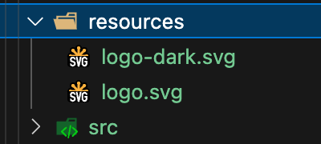
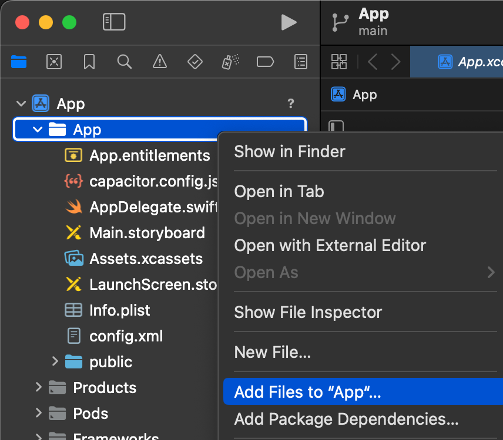

# TEST DE COMPONENTS NATIUS

Cada vegada que angular, ionic o capacitor puja de versions utilitzarem aquest projecte per provar i arreglar tots els compoments.

## Estructura del projecte

- A la carpeta `src/core-native` hi ha la implementació de la capa nativa amb els arxius que despres copiarem als projectes finals.
- A la carpeta `src/app` hi ha els components per provar cada un dels Plugins.

## Procediment

No es treballa directament sobre el projecte, el que fem és anar-lo clonant. Per això primer s'ha de crear un nou projecte amb les noves versions, després copiar-hi les dues carpetes d'aquest projecte. I finalment traspassar tot a aquest projecte.

## Pasos a seguir.

1. Actualitzem totes les versions de les aplicacions:
    - Android Studio
    - Xcode (Apple)

1. Actualitzem el client de `ionic`. https://ionicframework.com/docs/intro/cli#install-the-ionic-cli

    ```shell
    npm uninstall -g ionic
    npm install -g @ionic/cli
    ```

1. Crearem un nou projecte de ionic, https://ionicframework.com/docs/intro/cli#start-an-app 
    
    El nom del nou projecte no pot conincidir amb el del repositori, farem servir el número de la versió més recent de IONIC, per exemple: per la versió 8 `ion8`

    ```shell
    ionic start ion8 sidemenu
    ```

1. Arranquem l'aplicació perque es compili per primera vegada, https://ionicframework.com/docs/intro/cli#run-the-app

    ```shell
    ionic serve
    ```

1. Instalem ios i androdid, https://capacitorjs.com/docs/getting-started 

    ```shell
    npm i @capacitor/android @capacitor/ios
    npx cap add android
    npx cap add ios
    ```

1. Instalem electron https://capacitor-community.github.io/electron/docs/gettingstarted

    ```shell
    npm i @capacitor-community/electron
    ```

1. Cal donar un nom al projecte:

    `capacitor.config.ts`:
    ```typescript
    const config: CapacitorConfig = {
        appId: 'test.metacodi.com',
        appName: 'test-native',
        webDir: 'www',
        server: {
            androidScheme: 'https'
        }
    };
    ```
    
1. Hem de modificar les opcions de compilació del projecte:

    `tsconfig.json`:
    ```json
    {
        "compilerOptions": {
            "strictPropertyInitialization": false,
        }
    }
    ```
    
1. Hem d'habilitar les dependencies CommonJS:

    `angular.json`:
    ```json
    {
        "projects": { 
            "app": {
                "architect": {
                    "options": {
                        "allowedCommonJsDependencies": [
                            "zone.js",
                            "file-saver",
                            "jssip",
                            "moment",
                            "localforage",
                            "@braintree/sanitize-url",
                            "dayjs",
                            "dompurify"
                        ],
                    }
                }
            }
        }
    }
    ```

1. Si el nou projecte s'ha creat dintre d'una subcarpeta `ion8`, s'ha d'enrutar l'arxiu de configuració del projecte perque el eslint pugui trobar-lo:

    `.eslintrc.json`
    ```json
    "overrides": [
        "parserOptions": {
            "project": ["./ion8/tsconfig.json"],
        },
    ]
    ```

1. Cal provar que totes les plataformes funcionin correctament. Per fer-ho utilizem l'script `do`

    ```shell
    sh do ios
    sh do android
    sh do electron
    ```

1. Borrem primer i despres copiar les carpetes de l'antic projecte `test-native` al nou projecte `ion8`.
    - `src/app` 
    - `src/core-native` 


1. Actualitzem els plugins seguint les instruccions de `update-plugins.md`.

1. En aquesta carpeta tenim `src/app/app-routing.module.ts`. On tindrem que anar descomentant els component que volguem provar.

    ```ts
      // {
      //   path: 'app',
      //   loadChildren: () => import('./app/app.module').then( m => m.AppPageModule)
      // }
    ```

1. Aquest components els tenim en el projecte a la carpeta `src/core-native`

      []

1. I descomentant del l'arxiu `src/core-native/index.ts`, pq els puguis indexar.

1. En cada component tens la manera de instalarlo, per exemple: `app.ts`

    ```ts
      * **Capacitor**
      *
      * - Api: {@link https://capacitorjs.com/docs/apis/app}
      * - Examples : {@link https://medium.com/javascript-in-plain-english/opening-another-app-from-your-ionic-5-app-becf8c098d0e}
      */
    ```

1. Compilem i arreglarem les cosestes que hi hagui en cada pluguin.

    ```shell
    ionic build
    ```


1. Pel que fa als icones i splash screen, copiem de la carpeta `resources` els arxius al nou projecte, seguix el link per saber q fer, perque van variant les formes de fer-ho. https://capacitorjs.com/docs/guides/splash-screens-and-icons

    - En aquest cas optarem per la millor opció, el logo en SVG

    - Instal·lem l'eina

        ```shell
        npm install --save-dev @capacitor/assets
        ```
    - Hem de tenir els arxius a la carpeta `resources`    

      []

    - Executem l'eina indicant la carpeta `resources` amb el paràmetre `--assetPath`

        ```shell
        npx @capacitor/assets generate --assetPath resources
        ```
        
1. I una verga feta la instalació del primer component iniciem IOS, android i Electron per provar

    ```shell
    ionic build
    npx cap copy android
    npx cap copy ios
    npx cap copy @capacitor-community/electron

    npx cap sync android
    npx cap sync ios
    npx cap sync @capacitor-community/electron

    npx cap open android
    npx cap open ios
    npx cap open @capacitor-community/electron
    ```


1. Per provar Android, has de tenir el SDK de la versió que correspongui, ara estem per la 11.

      []

    - Copiem l'arxiu de l'antic projecte `android/app/google-services.json` al nou projecte

1. Per Provar IOS.

    - Copiem l'arxiu de l'antic projecte `ios/App/App/GoogleService-Info.plist` al nou projecte
    - El tenim que inclure.

      []

    - Hem de afegir les configuracions de cada pugin necesari a `ios/App/App/Info.plist`, cada pugin te la seva.

